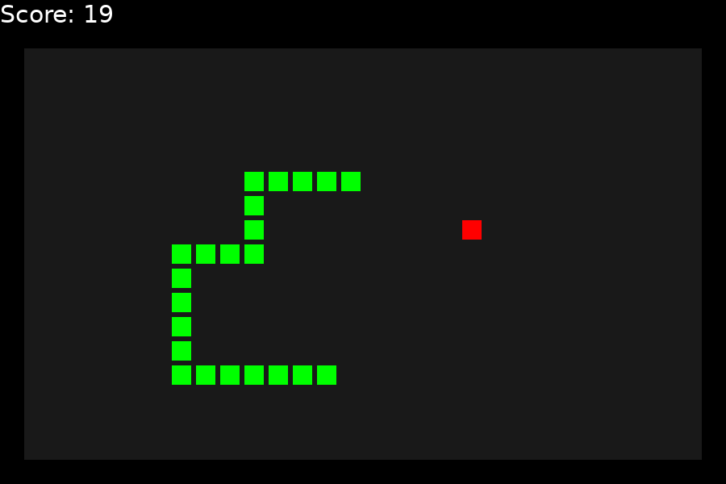

# scuffed-snake

A really bad implementation of snake in Lua



## Quick Start

Install the [LÖVE](https://love2d.org/) game framework.

Then go to the project root, and run

```
$ love .
```

to start the game.

## Controls

 - W/A/S/D or arrow keys: Move the snake
 - Enter: Restart the game
 - Escape: Quit the game
